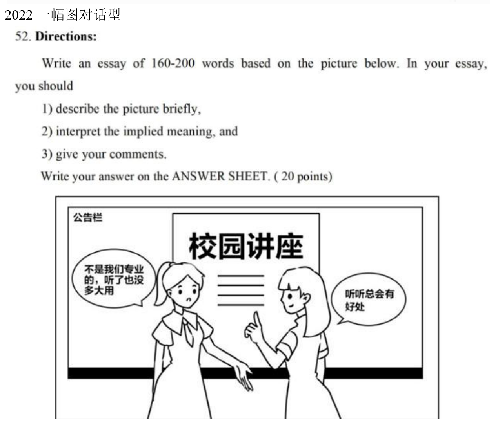
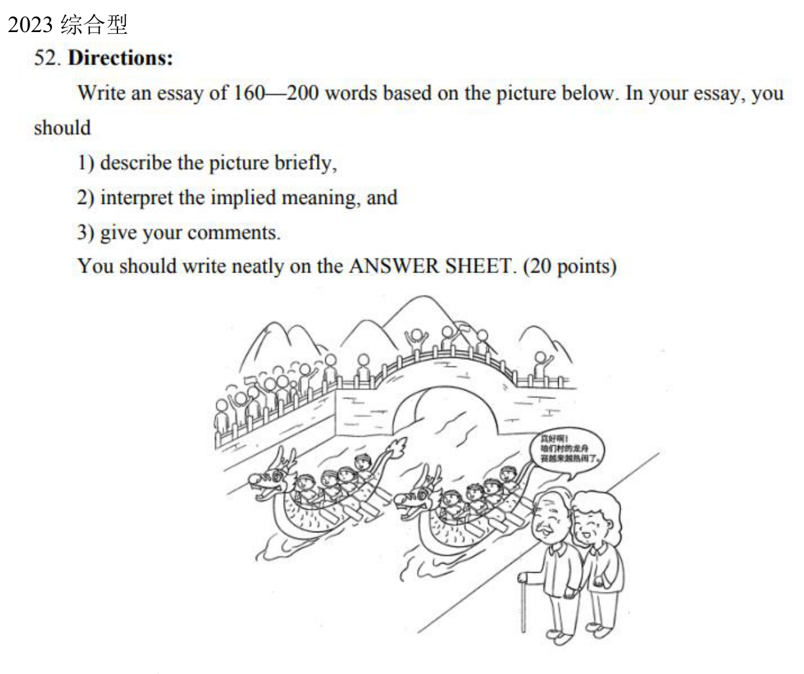
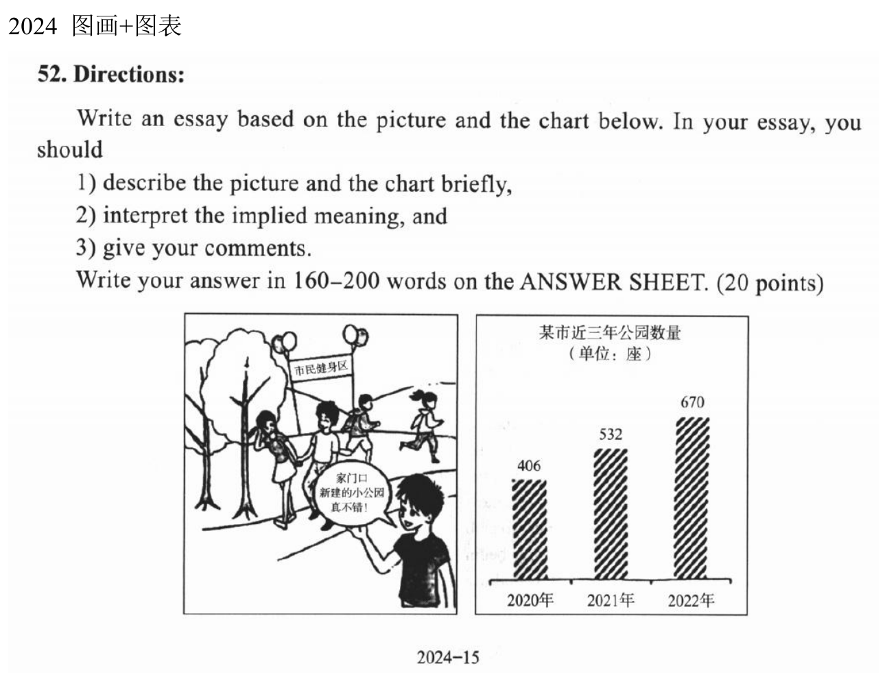

我写考研英语大作文时，最容易卡住的是：看懂了图，却不知道第一句怎么落笔；背过不少表达，到了第二段又不知道该往哪里放。后来我把自己写过的校园讲座、龙舟赛、公园数量三篇作文放在一起复盘，才发现，我真正稳定使用的句式其实不多。

这篇就是我的写作笔记。我会把**固定骨架、需要临场填的内容、原稿暴露的问题**放在一起讲，最后用三道资料中的真题完整走一遍。模板能帮我减少组织句子的负担，但审题、数据、句法和论证仍要自己负责，也不能据此保证分数。

## 一、先记住三段各自要完成什么

这三道题的要求都是：简要描述图画或图表，解释寓意，再给出评论；篇幅为 **160–200 词**。我用三段分别承接这些任务。

| 段落 | 我在回答的问题 | 我惯用的内容 |
| --- | --- | --- |
| 第一段 | 图中发生了什么？它想表达什么？ | 描述主体、动作、对话或数据，然后点题 |
| 第二段 | 为什么我支持这个观点？ | 身边例子 → 一般层面的好处 → 另一项好处 |
| 第三段 | 我们接下来可以怎么做？ | 总结重要性 → 两项措施 → 回扣主题的收尾 |

我的个人习惯是先判断题型，再在脑子里定主题，不写完整中文提纲。为了说明每一步，我在这里把脑中的分析展开；实际练习时，只需记几个关键词。通用模板建议约五分钟定框架、二十分钟写作，我把它当作练习时间分配，具体仍按整张试卷的节奏调整。

我以前三篇的归档字数分别标为 222、243、244 词，都超过了题目上限。这个结果提醒我：**会填模板之后，还要练习删句。** 我现在会先争取把正文控制在约 180–195 词，留出检查和调整的余地。

## 二、拿到题，我怎样逐步分析

### 第一步：读题干，再判断描述方式

先圈出材料形式、任务和字数。是只看图，还是图画与图表都要写？有没有对话？数据表示某个时间点的占比，还是跨年份的变化？第一段必须覆盖题目给出的材料。

下面是我的描述公式。公式只规定信息的顺序，具体句子仍要符合英语语法。

| 题型 | 我的描述公式 | 写的时候注意什么 |
| --- | --- | --- |
| 一幅图，非对话型 | 环境 + 基本动作 + 主体 + 主要动作 + `with` 细节 | 只挑关键细节，不把图中每个东西都写出来 |
| 一幅图，对话型 | 环境 + 主体动作 + A 的话 + 关联词 + B 的话 | 对话不能改变原意；如果只有一段话，只写那一段 |
| 两幅图 | 左图主体与动作 + 关联词 + 右图主体与动作 | 相似可用 `Similarly`，对比可用 `By contrast` |
| 图画 + 图表 | 图画描述 + 图表描述 + 合并点题 | 两种材料都要出现，找出它们的共同主题 |
| 动态图表 | 总体描述 + `To be specific` + 数量变化 | 先核对年份、单位和数字，再选趋势词 |
| 静态图表 | 各类别 + `account for` + 对应占比 + `respectively` | 类别顺序与百分比顺序一一对应 |

我会的基本动作是 `stand / sit / lie / run / stay`。环境清楚就写具体地点；不清楚时可以用 `in the middle of the picture`，但不必为凑公式添加图里没有的信息。

例如校园讲座，我习惯写：

> As is vividly shown in the cartoon above, in front of a lecture poster stand two undergraduates.

这里是“地点短语 + 动词 + 主语”的完全倒装，`stand` 对应复数主语 `two undergraduates`。如果不熟悉倒装，写 `two undergraduates stand in front of a lecture poster` 也能完成描述。我的公式不能让每一句都强行倒装。

动态图表可用：

```text
The chart shows [数据对象] from [起始年份] to [结束年份].
To be specific, [数据对象] increased from [起始数值] to [结束数值].
```

静态图表可用：

```text
[A], [B], [C] and other categories account for [a]%, [b]%, [c]% and [d]%, respectively.
```

四个类别作并列主语，要用 `account`，不能照源模板写成 `accounts`。如果主语改为 `The percentage of A`，谓语则要按单数处理。静态图没有跨时间的比较时，也不能套“从某年到某年发生变化”的句子。

### 第二步：把画面事实变成一句观点

我会在脑中问三个问题：**图里最重要的事实是什么？事实之间有什么关系？我准备赞成或提醒什么？**

以校园讲座为例：

1. 事实：两个学生讨论是否要听一场与专业无关的讲座。
2. 关系：一个只看直接用处，另一个认为听听也有好处。
3. 观点：学习不必局限于本专业，接触其他领域有助于成长。

这样，第一段最后一句才有依据：

> The purpose of the drawing is to remind us that extensive learning plays a crucial role in our personal growth.

`remind us that` 后面填**完整判断**，包括主语和谓语，不能只塞一个 `personal growth`。我通常选择正面的主题来写；如果题目主要是在批评某种行为，则要明确指出问题，后面的例子与措施也要跟着调整。这份骨架来自三篇正面题材，不能省略这一步判断。

### 第三步：准备一组主题词，保持意思连贯

我的词来自主题词库，但每篇只选几项，不整行搬过来。先确定一个中心词，再准备能自然接上的具体词和概括词。

| 题材 | 具体切入 | 适度概括 | 可以论述的好处 |
| --- | --- | --- | --- |
| 校园讲座 | `attending campus lectures` | `extensive learning` | `personal growth / comprehensive abilities` |
| 龙舟赛 | `dragon boat racing` | `traditional culture / cultural heritage` | `cultural confidence / cultural identity` |
| 公园建设 | `the construction of parks` | `public facilities / infrastructure development` | `quality of life / physical and mental health` |

换词的前提是意思接得上。`attending campus lectures` 是一种学习方式，`extensive learning` 是更宽的概念；`cultural confidence` 是可能的结果，不是 `dragon boat racing` 的同义词。上义词、下义词和结果词可以在同一篇里使用，但要分别放到适合的位置。适度重复中心词也比为了“换词”而改变主题更稳妥。

### 第四步：先分清“好处五方面”与“措施五角度”

资料里有两组容易混在一起的“五”。我现在分开记。

**第二段找好处**时，我用语料中的五方面：社会、自然、文化、个人、交流。**第三段想行动**时，我用模板中的五角度：政府、公民意识、个人行为、媒体、子女教育。

| 好处方面 | 我常用的语料 | 适合怎样的联系 |
| --- | --- | --- |
| 社会 | `public services / social progress / social cohesion` | 公共设施改善服务，集体活动加强联系 |
| 自然 | `sustainable development / ecological balance` | 环境保护、资源利用 |
| 文化 | `cultural confidence / cultural identity` | 参与传统活动、了解历史 |
| 个人 | `personal growth / quality of life / physical and mental health` | 学习、锻炼、日常生活 |
| 交流 | `enhance mutual understanding / facilitate information sharing` | 合作、人际沟通、信息交流 |

我的实际习惯偏向社会与个人方面，但校园学习题就主要落在个人成长，龙舟题则自然落在文化认同。我不会因为某个短语背得熟，就把每件事都写成“促进经济增长”。先补出中间一步，关系才清楚：**公园增加 → 附近有地方锻炼 → 更容易形成锻炼习惯 → 有益健康。**

还要看词性。`of great importance to` 后面可以接 `personal growth` 这样的名词，也可以接 `protecting cultural heritage` 这样的动名词；不能直接接动词原形 `protect cultural heritage`。`enable residents to` 后面则接动词原形，例如 `lead a healthy lifestyle`。

### 第五步：给第二段三个理由分工

我的固定顺序是：

> **For instance, → Furthermore, → In the end,**

原来的通用模板第一个连接词是 `Above all`，但我第一项总是举例，所以改成了 `For instance`。公园原稿曾用 `In addition`，个人模板后来统一为 `In the end`，这里保留这个习惯。它常有“最终”的意味，用作第三项论点的衔接略显生硬；若以后愿意调整，`Finally` 会更直接，但这篇先按我的习惯练。

三个位置分别承担不同功能：

- **例子**：家乡或身边的人做了什么，结果怎样。
- **一般论述**：某类人能从这件事得到什么好处。
- **补充好处**：再写一个与前面不同的结果，用 `not only ... but also ...` 收束。

我的例子通常来自家乡或室友，不背名人故事。最完整的习惯框架是：

```text
For instance, [一个完整的例子句], which [结果].
During [与例子对应的时间段], [进一步结果或心态].
```

例如，参加跨专业活动获得知识，进一步影响学习或求职。但如果字数不够，第二句可以删掉，或者把结果合并。`During the period` 只有前文交代了具体时期才清楚；`Over the past few years` 则不是同一个时间含义，后面通常配现在完成时。

这里的生活例子是写作练习中的设例，不能把“我的室友拿到外企 offer”当作经过核实的真实经历。末尾案例使用的是**真实题目资料**，范文里的生活故事仍是原作文素材的改写。

## 三、我实际背的完整填空骨架

下面按个人习惯模板整理。方括号是需要替换的内容，不要写进最终作文；第一段按题型选一种，图画加图表时把两类描述合起来。所有空格都填满会偏长，所以我把它看成句子储备，成文时按字数取舍。

### 第一段：选对入口，再点题

```text
【图画】
As is vividly shown in the cartoon above, [环境、主体和动作].
[需要时转述对话，保持原意].
The purpose of the drawing is to remind us that [主题判断].

【图表】
According to the figures given in the chart, [数据对象和变化或占比].
It is apparent from the statistics that [与数据相符的判断].

【图画 + 图表】
As is vividly shown in the picture, [图画信息].
According to the figures given in the chart, [数据变化].
The picture and the chart remind us that [共同主题].
```

`cartoon / picture / bar chart / line chart / pie chart / table` 按材料选，不为了替换而把柱状图叫成饼图。图表只直接告诉我数量或占比，背后的好处需要在论述中说明。例如公园数量增加支持“设施扩充”的判断，不能单凭柱状图就断言“所有市民的满意度提高”。

### 第二段：我的固定组合

```text
There are a host of factors to account for my opinion.
For instance, [完整例子句], which [结果].
During [时间段], [进一步结果或心态].
Furthermore, the majority of [人群] believe that [主题行为及好处],
which may put them in a beneficial position in the future.
In the end, not only does [单数主语] [动词原形及宾语],
but it also [第三人称单数谓语及补充内容].
```

我保留原模板的 `There are a host of factors to account for my opinion`。它可以理解为引出支持观点的因素，不过在这种短篇评论中，`Several reasons support this view` 会更简洁。我的练习仍先用熟固定句，再决定是否改写。

| 占位符 | 要填什么 | 检查方法 |
| --- | --- | --- |
| 完整例子句 | 谁 + 做了什么 | 不能只有 `my hometown` 一个名词 |
| `which` 后的结果 | 谓语 + 所需宾语或补语 | 读者能否看出它指前面的哪件事？ |
| 人群 | `students / residents / people` 等 | `them` 必须有清楚的指代 |
| 主题行为及好处 | 一个带主谓的从句 | `believe that` 后不能只放主题名词 |
| 单数主语 | `extensive learning / valuing heritage` 等 | 配 `does`，之后动词还原 |
| 补充内容 | 另一项具体好处 | 不要重复前一句的同一个意思 |

`the majority of people believe` 是我的习惯表达，但不是调查结果。使用它时我只写一般性的看法，不虚构比例或声称“研究证明”；如果没必要描述多数人的意见，也可以改为 `Many students find that ...`。末尾示范保留习惯骨架，以便对照位置。

`which may put them in a beneficial position in the future` 适合学习、能力等可以解释“未来优势”的语境。公园题如果只讨论日常锻炼，直接写 `which can improve their health` 更清楚。固定的是“好处 → 后果”的功能，不需要每题都重复同一个后果。

### 第三段：总结、五选二、收尾

```text
We should bear in mind that [主题名词或动名词] is of great importance to [相关方面].
[从下面五个角度中选择两项，填成与题目相关的措施].
If these proposed measures are taken, a harmonious balance between [A] and [B]
will be within our reach.
```

| 措施角度 | 我的备选句 | 空格怎样填 |
| --- | --- | --- |
| 政府 | `It is imperative for the authorities to allocate more funds to [项目].` | 名词或动名词：`park maintenance / protecting local traditions` |
| 公民意识 | `We should also raise awareness of [对象] among children and adults.` | `environmental protection / cultural heritage` 等名词 |
| 个人行为 | `We ought to spare no pains to [行动].` | 动词原形：`expand our horizons / take regular exercise` |
| 媒体 | `Mass media, such as radio, television, newspapers and the Internet, should [行动].` | `encourage the public to ... / report on ...` |
| 子女教育 | `Parents and teachers can set a good example for children by [行动].` | 动名词：`learning about different subjects` |

这里保留五选二的安排。我的龙舟和公园原稿选政府、媒体，校园讲座选个人行为、子女教育。选择的依据是：**这个主体能做什么，做完怎样帮助主题？** 校园讲座未必需要制定法律，公园题也不能只写“大家要重视”。

收尾里的 A、B 必须有可讨论的关系。例如 `specialized study` 与 `broader learning` 可以谈平衡；“社会进步”和“人民幸福”往往相互促进，硬写成需要平衡的两端就不够具体。若找不到自然的 A、B，我会像龙舟原稿那样改成直接结果：

> With these efforts, traditional culture can remain a living part of our communities.

## 四、原模板中，我要明确修正的地方

背句子之前，我会先把问题圈出来。下面区分句法错误、搭配问题和意思问题，避免把“不够自然”一概说成“不合语法”。

| 原资料中的写法或说法 | 问题 | 我会怎样修正 |
| --- | --- | --- |
| `As is shown in the picture above.` | 单独作一句缺少主句 | `As is shown in the picture above, two students ...` |
| `According to the figures given in the chart.` | 只有介词短语，没有主句 | 逗号后接 `the number of parks increased ...` |
| `A, B, C and others accounts for ...` | 并列主语与谓语不一致 | 用 `account for` |
| `The percentage of ... see a slight increase.` | 单数主语与谓语不一致 | 按时间用 `sees / saw a slight increase` |
| `Not only does X increase Y but also enables them to ...` | 第二分句缺清楚的主语，结构不完整 | `Not only does X increase Y, but it also enables them to ...` |
| `awareness of environment protecting` | 名词搭配生硬 | `awareness of environmental protection` |
| `should appeal to expand ...` | 表示呼吁某人做事时，结构缺对象 | `should appeal to the public to ...` |
| `radios, televisions` 表示大众媒体 | 更像在列举设备 | 用 `radio, television` |
| `measures are achieved` | 措施一般是采取或实施，目标才是达成 | `measures are taken / implemented` |
| `cultural deposits` | 直译“文化底蕴”，这里不自然 | 根据上下文选 `cultural heritage / rich cultural traditions` |
| `cultural rejuvenation` 等于 `national rejuvenation` | 两者含义不同 | 民族复兴用 `national rejuvenation`；本题直接谈文化传承即可 |
| `set a good example ... on learning beyond one's major` | 搭配与代词衔接不够清楚 | `set a good example ... by learning about different subjects` |

源模板还把 `remind` 列成可以直接换成 `convince / highlight the fact`，这不能只替换一个词。`remind us that ...` 与 `convince us that ...` 的语气不同；`highlight` 应写 `highlight the fact that ...`，不能保留后面的 `us`。同样，词表把 `aggressive` 作为“有进取心”的正面修饰词，我会谨慎使用，因为它也可能表示好斗；不熟悉语境时，`active / ambitious` 更容易控制。

我最常用的两个句法，也值得单独检查：

- **非限定性 `which`**：用逗号引出，指代前面的名词或整件事。室友学日语的例子里，若写成 `Japanese, a language ..., which brought him ...`，读者可能不清楚到底是语言还是学习经历带来结果。我会改成 `studied Japanese ... , which helped him ...`，让动作与结果靠得更近。
- **句首 `not only`**：主语是单数时写 `Not only does learning broaden ...`；复数时写 `Not only do lectures broaden ...`。后半句恢复普通语序：`but it also improves ...` 或 `but they also improve ...`。如果不熟悉倒装，就用 `Learning not only broadens ... but also improves ...`。

最后是事实检查。公园原稿把 2020–2022 年的 406、532、670 写成了 2024–2026 年的 62、80，句子再顺也不能弥补。复盘把 `rose sharply` 视作不贴切，我在修订版用 `increased steadily` 表达连续增长；**不是有增加就写 sharply，数字准确比副词华丽更重要。**

## 五、我写完怎样检查与压缩

我会按下面的顺序检查，避免最后只盯着高级词汇。

1. **任务**：图画、图表有没有漏写？有没有解释主题、给出评论？
2. **事实**：人物、对话、年份、数字、单位是否与材料一致？
3. **观点**：三段是否围绕同一个中心？换词后有没有换了意思？
4. **语法**：主谓一致、倒装、动词形式、代词指代、逗号和句号。
5. **字数**：按题目控制在 160–200 词；练习时统计，考场根据自己每行的平均词数估算。

需要删的时候，我先删与主题无关的修饰，例如 `my hometown, a beautiful city` 中的 `a beautiful city`；再删粽子口味这样的长列举、没有新增信息的心态句，以及重复的未来后果。我尽量保留材料描述、中心判断、例子的因果关系和两项具体措施。

三个理由也不必长度相等。举例一句，一般好处一句，补充好处一句，已经可以承接骨架；例子后再补一句 `During ...` 是完整练习版的选项。以下示范会展示这种取舍。

## 六、三个真题案例：从题目到完整英文

下面三题来自我的本地题目图片、范文与复盘。图片保留资料原样，英文是**根据原稿修订、压缩的教学示范**，不是原文照录，也不是官方范文。每一篇都保留三段结构、第二段固定连接词以及第三段五选二；字数按空格分词统计，连字符词算一个，校园讲座、龙舟赛、公园篇分别为 **191、193、186 词**。

### 案例一：2022 英语一，校园讲座



**我怎样审题：** 这是一幅带对话的图。左边说“不是我们专业的，听了也没多大用”，右边说“听听总会有好处”。我需要呈现两种观点，再落到广泛学习。这里的“没多大用”不必夸大成“完全无用”，所以修订版用 `of little use`。

**我怎样填空：** 环境填讲座海报前，主体填两个大学生；中心词选 `extensive learning`，理由中的具体行为写跨专业学习。好处选个人成长、知识和批判性思考。措施选个人行为与子女教育，最后把“专业学习与更广泛的学习”放进平衡句。

**完整英文示范：**

> As is vividly shown in the cartoon above, in front of a lecture poster stand two undergraduates. One says that the lecture is unrelated to their major and therefore of little use, while the other believes that attending it is beneficial. The purpose of the drawing is to remind us that extensive learning contributes to personal growth.
>
> There are a host of factors to account for my opinion. For instance, my roommate Kevin studied Japanese beyond his major, which helped him obtain a job offer. Furthermore, the majority of students believe that campus lectures provide opportunities to acquire knowledge, which may put them in a beneficial position in the future. In the end, not only does broad learning develop comprehensive abilities, but it also enables us to think critically.
>
> We should bear in mind that learning beyond our major is of great importance to our development. We ought to spare no pains to expand our horizons. Parents and teachers can set a good example for children by exploring different subjects themselves. If these proposed measures are taken, a harmonious balance between specialized study and broader learning will be within our reach.

**拆解：** 第一段完成“场景 → 两种看法 → 主题”，没有把一幅图误当作两幅图。第二段的 Kevin 例子沿用原稿素材，但去掉外企、高薪等装饰，保留“学习 → 机会”的关系；删掉 `During this period, all of us admired his capacity`，因为同伴的钦佩对主题支持有限。`Furthermore` 写获取知识，`In the end` 写能力与思考，功能仍对应我的三个位置。

第三段的两项措施都落在“自己去学习”和“给孩子示范”。原稿的 `measures are achieved` 改成 `are taken`，`on learning beyond one's major` 改成 `by exploring different subjects themselves`。`extensive learning`、`campus lectures`、`broad learning` 各有侧重，都围绕“不局限于专业”的中心。

### 案例二：2023 英语一，村里龙舟赛



**我怎样审题：** 河里是龙舟竞赛，桥上和岸边有观众，前景两位老人感慨村里的比赛越来越热闹。中心可以从具体的 `dragon boat racing` 提升到传统文化的传承与参与。这里先描述活动的热闹，再解释它与文化的联系，不能在描述里添加图中没给出的旅游收入。

源复盘曾把人物写成“老人对孩子”，并据此批评原范文的 `old couple`。我核对这张资料图后，看到的确实是两位老人，因此保留“两位老人”的客观描述；他们是否是夫妻没有必要判断。真正需要注意的是，“热闹”更接近 `lively`，不是单纯的 `exciting`。年份按已更正的资料写 **2023 英语一**。

**我怎样填空：** 主题组用 `dragon boat racing → traditional culture → cultural heritage`；好处选文化认同与社区联系。例子仍用家乡端午粽子活动，但不列出三种口味。措施选政府支持地方活动、媒体鼓励公众参与。此题没有自然的平衡两端，我沿用原稿直接畅想的收尾方式。

**完整英文示范：**

> As is vividly shown in the cartoon above, two dragon boats are racing on a river, while crowds watch from the banks and a bridge. Two elderly spectators remark that their village's race is becoming increasingly lively. The purpose of the drawing is to remind us that traditional culture deserves continued participation and support.
>
> There are a host of factors to account for my opinion. For instance, my hometown introduced new varieties of zongzi during the Dragon Boat Festival, which attracted more visitors. During the festival, residents shared their customs with younger generations. Furthermore, the majority of people believe that traditional activities strengthen cultural confidence, which helps preserve a shared identity. In the end, not only does valuing cultural heritage enrich community life, but it also brings people closer together.
>
> We should bear in mind that preserving traditions is of great importance to cultural development. It is imperative for the authorities to allocate more funds to local cultural activities. Mass media, such as radio, television, newspapers and the Internet, should encourage the public to participate in them. With these measures and everyone's efforts, traditional culture can remain a living part of our communities.

**拆解：** 第一段保留河流、竞赛、观众和对话这几项核心事实，点题强调参与与支持。第二段仍是我的“家乡例子 → 一般好处 → 并列好处”；`During the festival` 有明确的时间指代，进一步结果改为年轻一代了解习俗，使例子更贴近传承主题。

这篇没有强行写“传统文化让国家处于有利位置”，而用 `which helps preserve a shared identity` 承接文化自信。原稿的 `cultural deposits` 与含义含混的 `cultural rejuvenation` 不再使用；媒体句改成 `encourage the public to participate`，避免 `appeal to expand` 缺对象的问题。两项措施都围绕地方活动，收尾回到“文化存在于社区生活中”。

### 案例三：2024 英语一，公园数量与市民锻炼



**我怎样审题：** 左图有市民健身区，人物夸家门口新建的小公园；右图是某市近三年的公园数量，单位是座。先把数据记准：**2020 年 406 座，2021 年 532 座，2022 年 670 座**。这不是考试年份的数据，也不是百分比。

图画展示设施的使用，图表展示设施数量的增加。共同主题是公园等公共设施的发展怎样改善居民生活，而不是只写“大家应多运动”却漏掉建设这一层。数量增加本身也不能证明使用公平、维护充分或所有居民都满意，评论可以进一步提出这些要求。

**我怎样填空：** 第一段图一句、表一句，然后合并点题。主题选公园与公共设施，好处选生活质量和健康。第二段仍用家乡新增公园的例子。第三段选政府资金与媒体鼓励锻炼；收尾讨论城市发展与居民需要，让“平衡”的两端更具体。

**完整英文示范：**

> As is vividly shown in the picture, residents are exercising in a park, and a youngster praises the new park near his home. According to the bar chart, the number of parks in a certain city increased steadily from 406 in 2020 to 532 in 2021 and 670 in 2022. The picture and the chart remind us that public facilities can improve daily life.
>
> There are a host of factors to account for my opinion. For instance, my hometown built several parks, which gave residents convenient places to exercise. Furthermore, the majority of residents believe that green spaces create opportunities for physical activity, which can improve their health. In the end, not only does park construction improve the quality of life, but it also encourages a healthy lifestyle.
>
> We should bear in mind that public facilities are of great importance to people's well-being. It is imperative for the authorities to allocate more funds to park maintenance. Mass media should encourage the public to take regular exercise. If these proposed measures are taken, a harmonious balance between urban development and residents' needs will be within our reach.

**拆解：** 第一段写出全部三年数据，修正原稿的 `62 in 2024 to 80 in 2026`；`increased steadily` 对应连续上升，并没有把时间跨度写成另外几年。图表句主语是 `the number`，这里用过去式 `increased`；如果写一般现在时，则需留意单数主语。

第二段保留三个固定连接词，把家乡例子压成一句，不再加入城市漂亮、市民满意度明显上升等额外信息。一般好处强调锻炼机会，倒装句强调生活质量与习惯。第三段政府措施写维护经费，是为了让已有公园持续发挥作用；媒体措施写鼓励规律锻炼。原稿里长长的媒体列举删掉，句子的行动与对象仍然完整。

这三篇练习之后，我会继续背自己的固定顺序，也会反复练同一件事：看到题目，先把事实和观点说清楚，再把它们填进句子。能解释每个空格为什么这样填，模板才真正变成我会使用的写作工具。

---

本文整理依据：个人习惯模板与通用大作文模板；2022 校园讲座、2023 龙舟赛、2024 公园数量的三份复盘与三篇归档范文；“五大方面”与“主题词库”两份语料。三张题目图片来自同一组本地资料，复制到本文目录用于对照。本文只整理、修订教学示范，未修改源资料。
