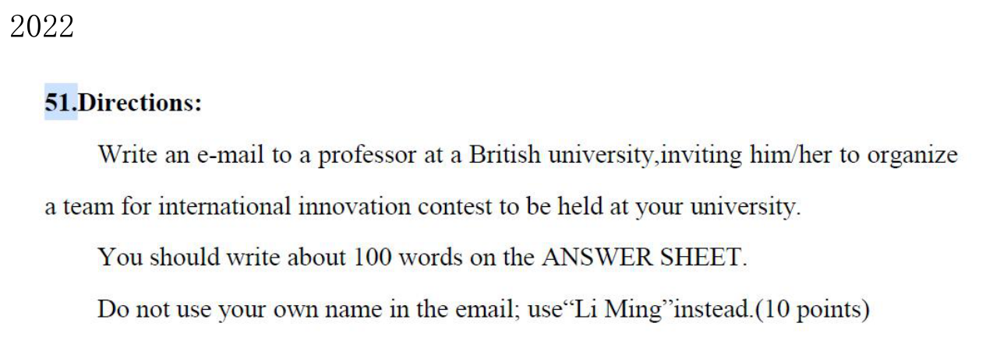
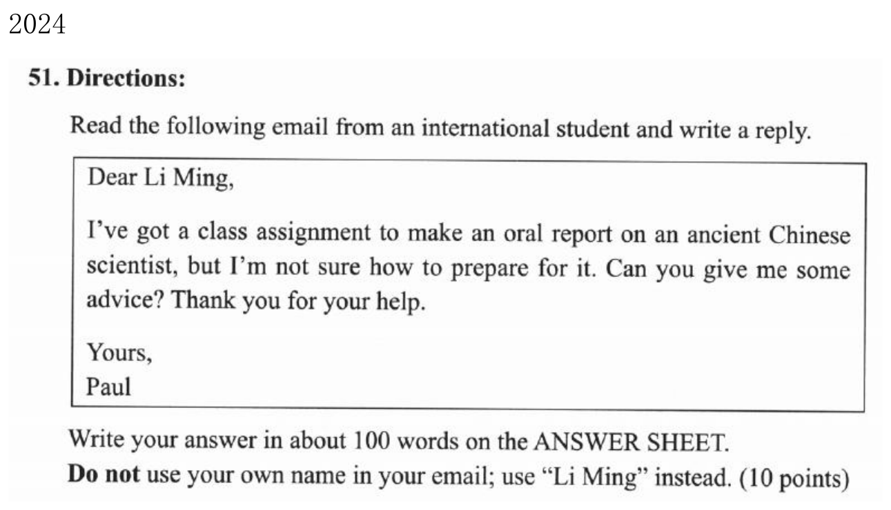
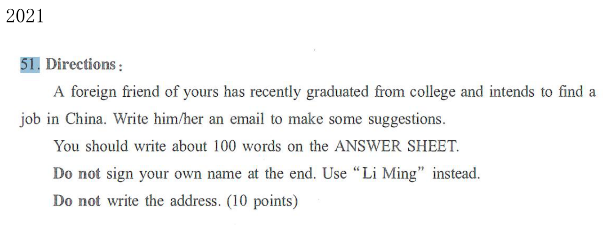

我写考研英语小作文时，最需要解决的事情是：看到题干以后，知道每一段该做什么，再把背过的句子放到合适的位置。我的信件模板已经有一套固定顺序：**认人 → 定意图 → 写第一段 → 第二段选两三点 → 收尾和落款**。真正需要根据题目动脑的地方，主要在第二段。

这篇笔记按我已有的私人信件、公务信函模板，以及个人习惯和复盘来整理。我保留自己实际用过的表达，也把原来句库里容易误套、搭配不准的地方单独校正。末尾三道题都给出完整英文信件，再说明每一句从哪里来、为什么这样填。

## 一、先认人：这封信走哪套开头

我拿到题先看收信人，而不是先背一句万能开头。我的日常判断是：朋友、同学、熟人和已经给我发来邮件的人，先走私人信件；陌生教授、经理、编辑、机构，先走公务信函。

| 我先看什么 | 私人信件 | 公务信函 |
| --- | --- | --- |
| 当前题目的关系 | 给朋友写信，或回复对方的来信 | 向陌生人、机构提出邀请、申请或请求 |
| 第一段第一句 | 背景提要：我听说了什么、收到什么消息 | 身份交代：我是谁，和这件事有什么关系 |
| 我的目的句习惯 | `I am writing to ...` | `I am writing this letter in order to ...` |
| 第二段共同骨架 | `The details can be listed as follows.`，再逐点展开 | 同左 |
| 我的连接词 | `In the first place / In the second place / In the third place` | 同左 |
| 第三段常用收尾 | 希望建议有用，欢迎继续联系 | 根据邀请、申请等目的表示感谢，再期待答复 |

这里的“认人”是我的快速分流方法，实际还要看写信目的和双方关系。**教授这个职位本身不等于陌生人，写给朋友的邮件也可能讨论正式事务。**我根据题干判断，不只盯着称呼。2024 年 Paul 已经发来求助邮件，回复时不用再介绍“我叫李明、我是学生”；2022 年向英国大学教授发出邀请，则先用一句身份介绍帮助对方理解我为何写信。

我的公务信模板要求开头交代身份，我会把它当作自己的稳定操作。它不是所有英文正式信件都必须采用的唯一写法。题干已经给出身份，就照题干写；没给具体专业，我也不用每次机械写成艺术系学生。

### 称呼先填准

| 题干提供的信息 | 我会怎样写 | 注意 |
| --- | --- | --- |
| 朋友的名字 Paul | `Dear Paul,` | 按题目给的名字写 |
| 教授的姓氏 Smith | `Dear Professor Smith,` | 有姓氏就加上 |
| 只说一位教授 | `Dear Professor,` | 2022 题可这样写 |
| 已知 Mr. / Ms. 及姓氏 | `Dear Mr. Lee,` / `Dear Ms. Lee,` | 不凭名字猜性别和头衔 |
| 不知道具体收信人 | `Dear Sir or Madam,` | 适用于面向机构的正式信 |
| 朋友未给姓名 | `Dear Jack,` 等合理称呼 | Jack 是我在2021范文中的自拟名，不是题干信息 |

我会在称呼后加逗号，把称呼单独放一行。称呼解决的是“对谁说”，首段解决的是“为什么说”，两者都不能漏。

## 二、审题时，我先填这六个空

我以前容易一看到“邀请”就写活动句，一看到“建议”就写好处句。现在我先从题目提取六项信息，再动笔。

1. **我是谁？**题干有没有指定学生会成员、志愿者、负责人等身份？有就优先用它；没有就选择和任务有关的简短身份。
2. **写给谁？**对方的名字、职位、关系，决定称呼和是否介绍自己。
3. **对方已经知道什么？**来信里的背景不用长篇重述，但不能改掉重要语境。
4. **我具体要做什么？**圈出 `invite`、`organize a team`、`make some suggestions`、`write a reply` 等任务词。
5. **第二段必须回答什么？**先列两三个中文关键词，再找可用句型。
6. **格式限制是什么？**约100词、署名 Li Ming、是否禁止写地址，都要看题干。

我尤其注意第四步里的具体动作。2022 年题干让我邀请教授**组织一支队伍参赛**，如果我只写“邀请您来参加活动”，就把核心动作弱化了。2021 年是给准备来华找工作的朋友**提供建议**，写信人并不是在申请一份工作，不能因此套上 `apply for a position`。

我给自己预留约15分钟：审题和列点约2分钟，写正文约10分钟，最后约3分钟查任务、格式、语法和篇幅。这是我的练习分配，实际可以按自己的速度调整。

## 三、我的私人信件完整模板

我最熟的一版是私人建议信。它的三段任务分别是：**听到消息并说明建议目的 → 给具体建议 → 希望有帮助并允许继续联系**。

```text
Dear [收信人名字],

I am very glad to hear that [题干中的背景，写成完整句子].
I am writing to make several suggestions about [建议的对象].

The details can be listed as follows.
In the first place, [建议一：具体动作，必要时补好处].
In the second place, [建议二：另一项具体动作].
In the third place, [建议三：补充行动或继续帮助的方式].

I hope you will find these suggestions helpful.
Please do not hesitate to contact me if you wish to discuss any of the points further.

Yours sincerely,
Li Ming
```

方括号只是我的练习占位标记，正式作答时要换成英文内容并删除标记。每两句首段、每几个分点句、两句收尾，在成稿里分别合成一个自然段，不把每句都写成独立一段。

| 占位位置 | 要填的东西 | 可以怎样填 |
| --- | --- | --- |
| `[收信人名字]` | 题干给定名字或合理称呼 | `Paul` |
| `hear that ...` | 完整的主语＋谓语＋背景 | `you plan to work in China` |
| `about ...` | 名词或名词短语 | `your job search` / `your report` |
| 建议一 | 首先要做的准备 | `gather information about the scientist` |
| 建议二 | 完成任务的方法 | `include interesting stories in your report` |
| 建议三 | 下一步或检查方式 | `share your draft with me` |

### 第一段：背景一句，目的一句

我的习惯是 `I am very glad to hear that ...` 加 `I am writing to ...`，不用每次都加 `this letter in order to`。前一句承接对方情况，后一句明确来意。

不过，“很高兴听说”要配合情境。如果朋友生病，我会用 `I am sorry to hear that ...`；道歉信不能因为模板熟就先写“很高兴”。背景句里的事实也要准确：Paul 是拿到一个课堂作业，要准备口头报告；我不能把它改写成他已经完成报告、准备发表成果。

### 第二段：把三条建议写成三件事

我的固定过渡句是：

> The details can be listed as follows.

我把它理解为“具体内容如下”。然后使用自己熟悉的三个连接词。**每个分点首先要有一个可以执行的动作**，比如搜集资料、准备简历、加入故事、分享草稿。好处句是补充，不能整段只剩“有助于发展、提高能力、取得成功”。

我常把三个分点安排成“准备 → 实施 → 检查”，但如果题目适合两个充分展开的点，也可以只用前两个连接词。三连是我的稳定习惯，不是每道题都必须写三条的硬性要求。

### 第三段：建议有用，欢迎联系

我的私人建议信收尾是两句：

> I hope you will find these suggestions helpful.  
> Please do not hesitate to contact me if you wish to discuss any of the points further.

第一句表示希望对方受益，第二句表示愿意继续沟通。这里的第二句是“欢迎联系”，并不强求对方一定回信。它比 `I am looking forward to your reply ...` 更适合我给朋友建议的语境。

这两句不能原封不动地放进所有私人信。若是邀请，我会改成接受邀请的期待；若是道歉，我会明确再表歉意。私人模板固定的是段落任务，情感句也要跟意图走。

## 四、我的公务信函完整模板

我最熟的一版是邀请教授的公务信。首段与私人信最大的区别，是先交代身份；中间仍然用同一个过渡句和分点连接词。

```text
Dear [职位或称呼],

I am a student from [院系或组织] at [学校或相关机构].
I am writing this letter in order to [写信目的，按题干具体动作填写].

The details can be listed as follows.
In the first place, [活动] will be held in [地点] at [时间].
In the second place, [活动流程、参加方式或对方需要做的事].
In the third place, [与这次邀请有关的收获、意义或支持].

We would appreciate it very much if you could accept our invitation.
I am looking forward to your reply at your earliest convenience.

Yours sincerely,
Li Ming
```

这是我的**公务邀请信版本**。其他公务信的第二段和收尾要换成对应功能，不用看到陌生人就把 `accept our invitation` 写进去。

| 占位位置 | 我的填写原则 | 2022题的落点 |
| --- | --- | --- |
| 职位或称呼 | 已知姓名则写姓名，只有职位则写职位 | `Professor` |
| 院系或组织 | 跟题干身份走，缺省时不堆无关信息 | 可以简化为 `a student at our university` |
| 写信目的 | 保留题目要求对方完成的动作 | `invite you to organize a team for the international innovation contest` |
| 活动 | 和目的句里的主题词一致 | `the contest` |
| 地点、时间 | 题干给定信息优先；缺失时只补合理细节 | 我校是题干事实，会议中心等是范文补充 |
| 流程 | 告诉对方怎样参加、做什么 | 团队协作挑战 |
| 收获 | 与活动有关的具体收获 | 创新经验、团队合作或奖项 |

我的原始身份句是 `I am a student from the department of Art at a university.`。它可以作为练习句背下来；正式作答时，我会优先使身份和题目一致。2022 题没有要求艺术系，因此不必为了复现模板而凭空指定专业，写 `I am a student at our university.` 就够清楚。

我的目的句习惯用完整式 `I am writing this letter in order to ...`，这和私人信的简式有区别，但**两种写法都能用于正式或私人场景**。这是我的记忆方式，不是英语语体的强制分界。如果篇幅紧，公务信也可以缩成 `I am writing to ...`。

### 邀请类第二段，我常用1／14／17组合

我的句库用编号记录素材。2022 年这篇的组合是：

| 原句库编号 | 段内任务 | 我实际用过的表达 |
| --- | --- | --- |
| 1 | 时间地点 | `The contest will be held in our conference center at 8:00 a.m. ...` |
| 14 | 活动流程 | `Participants will be divided into teams for a collaborative challenge ...` |
| 17 | 奖品收获 | `The profound experience will be memorable and the prize will be very valuable.` |

我会记住这个选点顺序，但也会按题目调整。邀请教授组织团队时，参赛方式和需要组织的队伍比奖品更关键；如果题干要求介绍规则，我就把第三点换成规则。句库里的 `profound experience`、`very valuable` 比较笼统，压缩时可以换成更具体的收获，如 `gain valuable experience in innovation`。

第三段的 `We` 表示我代表活动方发出邀请；前面 `I` 表示我这个写信人。这种转换可以保留，但不要毫无语境地交替使用 `I`、`we`、`you`。

## 五、写信意图怎样替换

第一段第二句的 `to` 后面，我要填动词原形，再补事件。题目要求什么，就选什么功能，不能只写一个空泛的 `help you`。

| 题目功能 | 我可直接接在 `I am writing to` 后的内容 | 第三段要回应什么 |
| --- | --- | --- |
| 建议 | `make several suggestions about your report` | 希望建议有用 |
| 邀请 | `invite you to organize a team for the contest` | 希望接受邀请 |
| 感谢 | `express my gratitude for your help` | 再次感谢具体帮助 |
| 道歉 | `apologize for missing our appointment` | 接受歉意和补救安排 |
| 咨询 | `inquire about the application process` | 希望获得信息或回复 |
| 推荐 | `recommend the exhibition to you` | 希望推荐有帮助 |
| 求助 | `request your assistance with the project` | 感谢考虑或帮助 |
| 求职 | `apply for a position as an assistant` | 感谢考虑申请 |
| 投诉 | `complain about the poor service` | 希望解决具体问题 |
| 通知或说明 | `inform you that the meeting has been postponed` / `provide further details about the plan` | 提供联系渠道或确认信息 |

我不需要在同一封信里使用整张表。把当前题的功能填准，首段就完成了。

## 六、第二段怎样从我的句库里挑

私人和公务两套通用模板的第二段素材基本共用。我真正要练的是“选句”，而不是按编号从头背到尾。

### 先选内容类别，再选句型

| 当前要写的内容 | 我的句库方向 | 填空前先想什么 |
| --- | --- | --- |
| 活动安排 | 时间地点、主题、参与范围、流程、收获 | 对方需要知道何时何地、怎样参与 |
| 推荐对象 | 景点、书籍、人物、电影、活动 | 推荐谁，依据是什么 |
| 求职或自荐 | 能力展示、经历、岗位要求 | 谁的能力，证明是什么 |
| 感谢 | 对方具体帮助及带来的效果 | 感谢哪件事 |
| 道歉 | 原因、影响和补救 | 怎样修复问题 |
| 建议或请求 | 通用型41—50 | 采取什么行动，能解决什么问题 |

我的私人建议例题主要依赖43／44／45和它们的变体。这三个句型能把动作与目的连起来：

```text
[43 请求与目的]
I wonder if you could [对方做的动作] so that I can [我随后能提供的帮助].

[44 条件与好处]
You could have more opportunities to [好处] if you [具体行动].

[45 建议与效果]
It is advisable to [具体行动], which can help you [效果].
```

例如，Paul 的第三点我写 `I wonder if you could share your draft with me so that I can offer you some specific advice.`。前半句要求他分享草稿，后半句说明我收到草稿能做什么，两个动作的主体都很清楚。

第二点我曾写 `You could have more opportunities to capture your audience's attention if you include some interesting stories ...`。句型可以复用，但压缩时不必保留所有词，写 `include interesting stories to capture your audience's attention` 就能保住方法和好处。

### 我背过的通用型41—50，各自适合什么

| 编号 | 我会使用的句型 | 合适的任务 |
| --- | --- | --- |
| 41 | `We are badly in need of [名词或动名词], which can help us [动词原形].` | 说明需求；语气较强，普通建议可用较温和表达 |
| 42 | `Due to [原因], it is convenient / possible for us to [动作].` | 说明原因和可行性，按情况换成否定词 |
| 43 | `I wonder if you could [动作] so that I can [目的].` | 请求、邀请继续交流 |
| 44 | `We could have more opportunities to [动作] if you improve [对象].` | 改进建议，主体和条件按题改 |
| 45 | `It is advisable to [动作], which can help you [效果].` | 一般建议 |
| 46 | `[活动] provides a unique opportunity to develop your creativity.` | 活动收获；这是我对原句的简洁改写 |
| 47 | `Your [能力或帮助] is key to [结果].` | 说明对方的重要作用；不用每次加 `Everyone agrees` |
| 48 | `[活动] allows you to engage with different cultures and social customs.` | 文化交流类收获 |
| 49 | `The students will not only have the opportunity to learn from you but also draw inspiration from your example.` | 邀请授课、分享或指导，按真实身份使用 |
| 50 | `If it had not been for your timely help, the consequences would have been serious.` | 回顾已发生的帮助，用于感谢；已校正原句语法 |

我自己的习惯词还有 `gather detailed information`、`capture one's attention`、`offer some specific advice`，以及 `which can help you ...` 补充效果。它们都要服务于题目，不是每篇必须各出现一次。

2021 来华求职的范文还用了“交流方面”和“个人方面”的素材：`facilitate effective communication`、`give full play to your advantages`、`gather information`。我把这些当作选材库；一封信只挑与当前问题有关系的方面，不为了凑齐所有方面而跑题。

## 七、我的常见错误，以及写完怎样校正

### 1. 把个人习惯当成必须照抄的规则

我用三段、固定连接词，是为了减少临场选择。题目有两个核心任务时，两个充分回答的分点也能完成第二段。首段的背景或身份、目的句、收尾都要合乎题意，不能因为背熟了就坚持原词不换。

### 2. 意图只写大类，漏掉题干的具体动作

2022 年应写 `invite you to organize a team for ...`，不能只剩 `invite you to attend ...`；2024 年要建议怎样准备报告，不能把全文写成一篇科学家介绍。2021 年要给朋友求职建议，不能把自己写成应聘者。

我检查时会问：**如果读者只看目的句，能不能知道我希望谁做什么？**

### 3. 句库里的搭配要修正

| 原资料里容易直接照抄的写法 | 我现在会写 | 校正理由 |
| --- | --- | --- |
| `The detail can be listed as follows.` | `The details can be listed as follows.` | 列举多项细节，用复数；个人习惯版已采用复数 |
| `invite you to participate / attend in ...` | `invite you to participate in the contest` / `invite you to attend the meeting` | `participate in`；`attend` 后直接接活动，不加 `in` |
| `inquire Sth. about ...` | `inquire about the schedule` | 询问某事可直接用 `inquire about` |
| `If there had been no your timely help ...` | `If it had not been for your timely help, ...` | 原句的 `no your` 不合语法；过去假设的结果可接 `would have ...` |
| `acquire his life, achievements ...` | `learn about his life, achievements and contributions` | 了解生平用 `learn about`；PDF提取例句的表达需校正 |
| `suggest you to do ...` | `suggest that you do ...` / `advise you to do ...` | `suggest` 不按 `advise somebody to do` 的结构使用 |
| `some advices` / `informations` | `some advice` / `information` | `advice`、`information` 通常是不可数名词 |
| `There stand at least two factors ...` | 建议列点仍用我的 `The details ...`；解释原因可用 `There are two main reasons ...` | 按内容选择更自然的过渡，不把原因句硬套给安排和建议 |

我也注意 `about` 后面的词形：`suggestions about your report` 是名词短语；`hear that you are preparing ...` 则需要完整从句。`to` 后写 `make`，不能写 `making`。我常用 `which can help you + 动词原形`；`help you to do` 也正确，只要句子结构保持完整。

### 4. 两篇原稿都偏长，最先压第二段

我的复盘把2024稿记为正文136词，2022稿记为125词，题目都要求 `about 100 words`。我按空白分词、不含称呼和落款重新核对，2024稿为136词，2022稿为125词，与归档记录一致。

我的压缩顺序是：先删第二段重复的好处，再删空泛形容词，最后考虑缩短完整目的句和长收尾。题目的具体动作、建议本身、称呼和落款优先保住。

例如：

```text
原写法：
You could have more opportunities to capture your audience's attention
if you include some interesting stories or examples related to the scientist.

压缩后：
Include interesting stories to capture your audience's attention.
```

“约100词”不意味着多一个词就必然扣分。我给自己把正文练习目标放在约95—110词，目的是避免再次写到130多词，也避免为了压缩删掉任务要点。下面压缩版的字数均按英文正文空白分词统计，不含称呼和落款。

### 5. 称呼和落款不能只存在于脑子里

我2022归档稿只有正文，2024稿的称呼和落款也是后来补齐的。练习转写可以注明缺项，考场成稿必须补全。我固定写：

```text
Yours sincerely,
Li Ming
```

我不使用自己的真实姓名。2021题明确要求不写地址，也不额外添加地址。

### 我的交卷前检查顺序

1. 对照题干，确认收信人、目的和具体动作都对。
2. 看三个段落：首段交代背景或身份与来意；第二段有具体内容；末段有合适收尾。
3. 看语法接口：`to + 动词原形`、`about + 名词`、`that + 完整句`、`in / at / on` 的时间地点搭配。
4. 看主题词是否一致：报告、求职、比赛不能在中途换成别的活动。
5. 检查称呼、逗号、署名 Li Ming，以及是否多写了题目禁止的地址。
6. 估算正文长度，优先删重复效果和空泛修饰。

## 八、例一：2022英语一，邀请教授组织团队参赛



### 我先怎样审题

收信人是一位英国大学教授，我按公务信处理；任务是邀请其组织团队参加我校举办的国际创新大赛。题目要求约100词，署名 Li Ming。

我列的关键词是：**教授 → 邀请组队 → 国际创新比赛 → 我校举办**。具体时间、会议中心、团队挑战和奖品不是题干已经给出的事实，而是我在范文中补充的合理细节。补充时不能和已知信息矛盾。

### 我的原稿补齐格式后

> Dear Professor,
>
> I am a student from the department of Art at a university. I am writing this letter in order to invite you to organize a team for the international innovation contest to be held at our university.
>
> The details can be listed as follows. In the first place, the contest will be held in our conference center at 8:00 a.m. on Sunday, December 20th. In the second place, participants will be divided into teams for a collaborative challenge, designed to foster teamwork and creative problem-solving. In the third place, the profound experience will be memorable and the prize will be very valuable.
>
> We would appreciate it very much if you could accept our invitation. I am looking forward to your reply at your earliest convenience.
>
> Yours sincerely,  
> Li Ming

这份稿子让我看清自己的写法：首段身份句照模板，目的句里的 `organize a team` 跟题干；第二段是1／14／17组合；第三段用邀请专属收尾。

| 位置 | 我怎样套模板 | 下一次怎样改进 |
| --- | --- | --- |
| 身份句 | `I am a student from ...` | 去掉题干未给的专业，写得更贴我校办赛情境 |
| 目的句 | 完整式＋邀请组队＋比赛名称 | 保留组队动作，可删重复地点说明 |
| 第一分点 | 时间地点句换活动名称 | 简化长日期，补充内容不冒充题干事实 |
| 第二分点 | 活动流程原句 | 压缩修饰，保留团队挑战 |
| 第三分点 | 奖品收获原句 | 用具体收获替代笼统形容词 |
| 收尾 | 感谢接受邀请＋期待答复 | 篇幅紧时稍作压缩 |

### 我会用于限时练习的压缩成稿

下面是保留我的连接词、完整目的句和邀请收尾的压缩版，正文94词：

> Dear Professor,
>
> I am a student at our university. I am writing this letter in order to invite you to organize a team for the international innovation contest.
>
> The details can be listed as follows. In the first place, the contest will be held at our university next month. In the second place, teams will work together on an innovation challenge. In the third place, participants will gain valuable experience in creative problem-solving.
>
> We would appreciate it very much if you could accept our invitation. I am looking forward to your reply at your earliest convenience.
>
> Yours sincerely,  
> Li Ming

我的压缩保留了邀请对象、组队任务和我校办赛信息；`next month` 是用于练习的补充时间，不能解释成真题原文。第二段仍按时间地点、流程、收获展开，删除了长时间表达和笼统奖品句。以后遇到邀请信，我先套这个任务顺序，再看题干有没有要求换掉某一点。

## 九、例二：2024英语一，回复Paul的报告准备求助



### 我先怎样审题

Paul 来信说，他拿到一个课堂作业，要做关于中国古代科学家的口头报告，但不知道怎样准备，希望我给建议。这里是**回复一封求助邮件**，我按私人建议信处理，不再写自我介绍。

第二段要回答“怎样准备”。我先列三点：**查生平和成就 → 用故事呈现 → 分享草稿继续修改**。题目没有指定某一位科学家，我可以给普遍适用的准备建议；如果推荐沈括，也应继续说明报告怎么准备，不能只写人物介绍。

### 我的原稿补齐格式后

> Dear Paul,
>
> I am very glad to hear that you are preparing to deliver an oral report on an ancient Chinese scientist. I am writing to make several suggestions about your report.
>
> The details can be listed as follows. In the first place, you need to do some research to gather detailed information, which can help you learn about his life, achievements and contributions. In the second place, you could have more opportunities to capture your audience's attention if you include some interesting stories or examples related to the scientist. In the third place, I wonder if you could share your draft with me so that I can offer you some specific advice.
>
> I hope you will find these suggestions helpful. Please do not hesitate to contact me if you wish to discuss any of the points further.
>
> Yours sincerely,  
> Li Ming

这是我私人模板的直接来源。它的优点是每一点都落到动作上，第三点还自然承接了“我愿意帮助你”。复盘里指出它偏长，第二段尤其容易把一个建议写成很长的效果说明。

| 位置 | 原稿中的填空结果 | 我的分析 |
| --- | --- | --- |
| 背景句 | `you are preparing to deliver an oral report ...` | 没写错任务，但省略了课堂作业背景；可以补 `for class` |
| 目的句 | `make several suggestions about your report` | 简式是我的习惯，目的明确 |
| 第一分点 | 搜集资料＋`which can help you learn about ...` | 动作和内容都对，压缩时可直接写搜集哪些资料 |
| 第二分点 | 条件式好处，模板44变体 | 可以改成行动＋目的，省词且更直接 |
| 第三分点 | `I wonder if you could ... so that I can ...` | 模板43，草稿和具体建议之间关系清楚 |
| 收尾 | 希望建议有用＋随时联系 | 保留我的私人建议信风格，长句可压缩 |

### 我会用于限时练习的压缩成稿

下面保留我的首段、过渡句、三连连接词和第三点请求句，正文100词：

> Dear Paul,
>
> I am very glad to hear that you are preparing an oral report on an ancient Chinese scientist for class. I am writing to make several suggestions about your report.
>
> The details can be listed as follows. In the first place, gather information about the scientist's life and achievements. In the second place, include interesting stories to capture your audience's attention. In the third place, I wonder if you could share your draft with me so that I can offer specific advice.
>
> I hope you will find these suggestions helpful. Please do not hesitate to contact me for further discussion.
>
> Yours sincerely,  
> Li Ming

我把 `which can help you learn about ...` 的内容直接并到资料搜集句里，把第二点的条件式长句改成 `include ... to capture ...`。这样没有删掉三条建议，也没有把“准备报告”改成“介绍科学家”。首段的 `for class` 保留了来信中的课堂语境，收尾仍然是欢迎继续讨论。

## 十、例三：2021英语一，给来华求职的外国朋友建议



### 我先怎样审题

对方是我的外国朋友，刚大学毕业，打算在中国找工作；我写邮件给建议，署名 Li Ming，不写地址。题干没有给朋友名字，我沿用已有范文自拟的 Jack。

我先列三点：**中文沟通 → 简历突出技能 → 在线找合适职位**。这里“求职”是对方的背景，我的写信功能是建议，因此首段仍用 `make several suggestions about your job search`。

### 完整英文范文

这篇保留我已有的成稿，正文97词：

> Dear Jack,
>
> I am very glad to hear that you plan to work in China. I am writing to make several suggestions about your job search.
>
> The details can be listed as follows. In the first place, improve your Chinese to facilitate effective communication. In the second place, prepare a resume highlighting your skills, which can help you give full play to your advantages. In the third place, gather information about suitable jobs online.
>
> I hope you will find these suggestions helpful. Please do not hesitate to contact me if you wish to discuss any of the points further.
>
> Yours sincerely,  
> Li Ming

### 我怎样逐段套出来

第一段的背景空填 `you plan to work in China`，目的对象填 `your job search`。这是我私人建议骨架最直接的换词，不需要增加“我是一名学生”。背景句虽然没有重述“刚毕业”，但保留了建议针对的来华工作计划；如果需要突出毕业信息，也可以在不改变意思的前提下补入。

第二段先挑做法，再补适量好处：

| 分点 | 具体行动 | 素材来源与句型 | 为什么贴题 |
| --- | --- | --- | --- |
| 第一 | `improve your Chinese` | 交流方面：`facilitate effective communication` | 来华工作需要沟通能力 |
| 第二 | `prepare a resume highlighting your skills` | 个人方面：`give full play to your advantages`；我的 `which can help you ...` | 把自身技能呈现给招聘方 |
| 第三 | `gather information about suitable jobs online` | 我的习惯动词 `gather information` | 从准备进入实际找职位的行动 |

第三段完整保留“希望建议有用＋随时联系”。这篇三条建议都短，所以能保留长收尾而没有明显拖长正文。它也提醒我：控制篇幅不一定要放弃熟悉的骨架，先把第二段写实、写短就有空间。

这三个例子里，我真正反复使用的是同一套操作：先把收信关系和目的弄清楚，再让每段完成自己的任务。下一次练习，我会先在草稿上写“人、目的、三点”，然后填入英文；复盘时则检查哪一句完成了任务、哪一句只是占了字数。

---

## 这篇笔记依据的资料

我整理时读完了私人信件目录中的通用模板、个人习惯模板、2024复盘、2024范文和2021范文，也读完了公务信函目录中的通用模板、个人习惯模板、2022复盘和2022范文。称呼、目的句和过渡句还对照了小作文PDF的文本提取稿；三个题目的任务信息以题目图片核对。

原资料保留了我的练习痕迹：2022公务邀请稿和2024私人建议稿是个人习惯的主要样本，2021稿展示了同一套私人建议模板的迁移。本文中的“我的习惯”指这些笔记已有的写法；压缩版和搭配校正是这次整理后的练习版本，不冒充原稿或官方标准答案。
