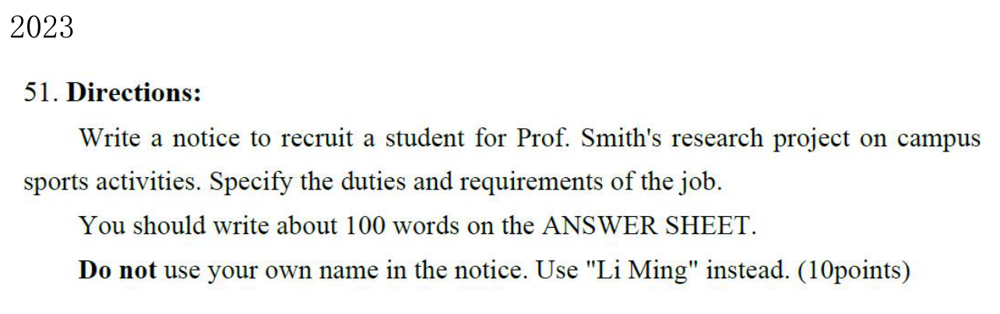

写 Notice 时，我最容易犯的错误不是不会写英文，而是把它写成一封信，或者写了很多邀请套话，却漏掉题目要求的职责、条件和参加方式。

这篇笔记整理的是我自己的通知模板。我的常用顺序是：**第一段喊人、说事；第二段先要求、后职责，再补好处；最后号召参加并交代怎么报名。** 活动通知则要换成时间、地点和活动内容。

这里的完整骨架来自我的个人习惯模板；末尾第一例按 2023 年英语一题目整理，后两例是为了练习迁移而编写的设题。示例中的日期和报名邮箱都是练习信息，不是实际活动安排，也不是官方范文。

## 先认格式：Notice 是公开通知

我的记忆方法是“通知是换了格式的书信”：可以共用信件第二段的素材，但读者和开头结尾都变了。信件写给具体收件人，通知面向一群读者。

| 位置 | 我的写法 | 注意点 |
| --- | --- | --- |
| 标题 | Notice | 写在正文上方，排版时可以居中 |
| 日期 | October 7, 2026 | 按题目要求填写；题目有日期就照题目，不机械照抄练习日期 |
| 正文 | 三段 | 先交代事情，再写关键信息，最后给行动方式 |
| 署名 | Li Ming 或题目指定组织 | 服从题目；练习时放在右下方 |

**不写 Dear ...，不写 Yours sincerely。** 我的旧稿曾只写正文，漏掉标题、日期和署名；现在我先把这些位置留好。日期和具体署名应服从题目要求，不把个人模板当成所有题目都必须照抄的格式规定。

## 第一步：圈出五项信息

拿到题目，我先用中文列提纲，不急着写套话。

1. **读者是谁？** 全体学生、对研究项目感兴趣的人，还是某个协会成员？
2. **通知什么？** 招募一名学生、招志愿者，还是举办讲座？
3. **必须写什么？** 例如 duties and requirements，就是职责和要求，两项都要出现。
4. **读者怎么行动？** 邮件报名、到指定地点参加，还是提交申请？
5. **格式与篇幅有什么限制？** 署名、日期、约多少词，都记在旁边。

以研究项目招募为例，我会写下：

> 面向学生 → Smith 教授要招一名学生 → 项目研究校园体育活动 → 必须写要求和职责 → 按题意决定是否补申请方式。

题目没给的信息可以在允许合理补充时简洁设定，但不能和已知事实冲突。**不要把自己编的截止时间、邮箱或岗位数量说成题目给定信息。**

## 第二步：决定第二段是哪一种

这是套模板之前最重要的一步。

| 通知类型 | 第二段先解决什么 | 可选补充 |
| --- | --- | --- |
| 招募通知 | 申请条件、具体职责 | 获得什么经验、报名方式 |
| 活动通知 | 时间、地点、活动内容 | 参与范围、需携带物品 |
| 更改或提醒通知 | 改了什么、什么时候生效 | 读者需要怎样调整安排 |

我常用的“要求 → 职责 → 好处”很适合招募题，但讲座通知不能硬写 candidates 和 successful applicant。遇到活动题，骨架可以保留，内容必须换。

## 第三步：第一段用“喊人 → 说事 → 引出细节”

### 先喊人

> Attention all students interested in [主题] on campus!

我原来的写法是 `Attention all students interested in the research project on campus!`。真正套题时，我会把笼统的 research project 换成更具体的主题，例如 campus sports。

`interested in` 后面接名词或动名词：

- interested in campus sports
- interested in volunteering
- interested in learning about traditional culture

### 再说事

招募研究项目学生：

> Prof. Smith is seeking a dedicated student to join his research project concerning [研究主题].

活动通知：

> A lecture on [主题] will be held at our university.

一句话应该让读者知道“谁要做什么”。题目只招一名学生，就写 a student；不要一会儿单数、一会儿又说招多人。

### 最后引出细节

> The following are the details of the relevant matters.

这是我习惯保留的过渡句。更简洁也可以写：

> The details are as follows.

两句选一句即可。字数紧张时，过渡句可以删，直接进入关键内容。模板的作用是帮我组织信息，不是要求每句都出现。

## 第四步：第二段先要求，再职责，最后好处

### 要求：谁适合申请

我的原骨架：

> The candidates should be enthusiastic about [主题] and have sound organization and communication skills.

我会根据岗位选能力，避免每次都写组织能力和沟通能力。整理后的自然表达是：

> Applicants should be interested in [主题] and have good [能力] skills.

| 任务 | 适合写的能力 |
| --- | --- |
| 调查与访谈 | communication skills、an interest in research |
| 数据整理 | basic computer skills、careful attention to detail |
| 活动志愿服务 | teamwork、communication skills |
| 英文接待 | a good command of English |

原句中的 `sound organization and communication skills` 可以理解，但 **good organizational and communication skills** 搭配更自然。我会保留原来的结构，调整措辞。

### 职责：录取后具体做什么

> The successful applicant will assist in conducting surveys, collecting and analyzing data for [项目].

这里是我最常用的职责句，适合研究项目招募。`assist in` 后面接动名词，所以是 conducting、collecting、analyzing；三个动作尽量保持平行。

志愿者岗位就换成：

> Volunteers will help welcome visitors and guide them around the campus.

不能只写 `help with the project`，要让读者知道实际工作。

### 好处：还有什么收获

> This opportunity will allow you to contribute to the development of our university while gaining valuable experience.

这句来自我的个人模板，但不是必写句。题目要求职责和条件时，我先确保这两项完整；有余量才补好处。更贴题可以写：

> This opportunity will help you gain experience in research and teamwork.

原模板第二段没有连接词，靠“条件 → 工作 → 收获”推进。短通知这样写并没有问题，不必为了形式加入 Firstly、Secondly、Finally。如果确实需要补充关系，可以用 Moreover，但内容之间有逻辑比连接词数量更重要。

## 第五步：结尾给读者一个明确动作

我的原结尾是四句：

> Don't miss this chance! If you are interested, this will be a memorable experience for you. We are looking forward to your enthusiastic participation. Please email us at [邮箱] to sign up.

它表达了号召、体验、期待和报名方式，但对约 100 词的作文来说，可能占用太多篇幅。我会按题目缩成：

> If you are interested, please email [邮箱] to apply. We look forward to your participation.

- 招募岗位：apply 更准确。
- 报名活动：sign up 更自然。
- 直接参加讲座：可以写 Please arrive on time，不必虚构报名流程。
- 题目没要求联系方式：不必固定加邮箱、二维码。

我的资料中出现了 `123456@qq.com`，它是练习占位地址，不是实际联系邮箱。

## 我的完整填空骨架

下面是我原习惯的整理版。方括号需要替换，正式成文时删掉提示。

```text
Notice
[日期]

Attention all students interested in [主题] on campus!
[负责人] is seeking a dedicated student to join [项目].
The following are the details of the relevant matters.

The candidates should be enthusiastic about [主题] and have
sound organizational and communication skills.
The successful applicant will assist in [职责一], [职责二]
and [职责三] for [项目].
This opportunity will allow you to contribute to [目标]
while gaining valuable experience.

Don't miss this chance! We are looking forward to your
enthusiastic participation. Please email [练习邮箱] to apply.

Li Ming
```

这是一份**选句骨架**，全部填满会偏长。实际写作时，我通常保留“说事、要求、职责、行动方式”，再决定是否加呼告、过渡和好处。标题和署名也要按题目改。

## 写完后，我按这个顺序检查

1. **内容**：题目要求的事项是否各有一句？有没有只写要求、漏写职责？
2. **格式**：有没有误写 Dear 和 Yours sincerely？标题、署名是否符合题目？
3. **人数**：a student、the successful applicant 和多人 volunteers 是否前后一致？
4. **动作**：读者知道到哪里、何时或怎样申请吗？需要的信息有没有漏？
5. **语言**：interested in、assist in 后的形式是否正确？并列动词是否一致？
6. **篇幅**：先删重复号召和空泛赞美，不删题目明确要求的细节。

我旧资料把研究项目通知标为“117 词”，但复盘里又出现另一组段落统计，两者不能同时直接采用。因此这里不照搬旧字数标签，考试练习以实际成稿重新计数；约 100 词也不意味着必须刚好 100。

## 例一：2023 英语一，研究项目招募



### 先把题目拆成四个问题

- **写什么？** Notice，公开通知。
- **为什么写？** 为 Prof. Smith 的项目招一名学生。
- **研究什么？** campus sports activities。
- **必须交代什么？** duties and requirements。

按我的第二段顺序：先说申请者要对体育和研究有兴趣，再说协助调查与数据处理。我的旧稿加了很多号召句；下面保留个人写法，压缩重复表达。示例日期和邮箱为练习补充。

### 整理后的成稿

> **Notice**
>
> October 7, 2026
>
> Attention all students interested in campus sports! Prof. Smith is seeking a student to join his research project on campus sports activities. The details are as follows.
>
> Applicants should be interested in sports and have good organizational and communication skills. The successful applicant will assist in conducting surveys, collecting information and analyzing data. This opportunity will help you gain valuable research experience and contribute to the improvement of campus sports activities.
>
> If you are interested, please email research@example.com to apply. We look forward to your participation.
>
> Li Ming

### 我怎样检查这篇

第一段已经说清项目和招募目标；第二段的 Applicants should 回答要求，will assist in 回答职责；第三段回答如何申请。即使删掉“收获”那句，核心任务仍完整。报名邮箱只是练习设定，原题没有给出这个地址。

## 例二：练习设题，校园开放日志愿者招募

**设题信息**：学生会招募校园开放日志愿者，介绍能力要求和工作职责，申请发往给定练习邮箱。活动设定在 10 月 18 日。

### 套用前先换内容

同样是招募，研究项目的 conducting surveys 不能照抄。开放日志愿者的工作是接待访客、指路、介绍设施，因此要求应围绕沟通、英语和团队合作。

### 成稿

> **Notice**
>
> October 7, 2026
>
> Attention all students interested in volunteering! The Students' Union is recruiting volunteers for our Campus Open Day on October 18. The details are as follows.
>
> Applicants should have good communication skills and be willing to work in a team. A good command of English would also be helpful. Volunteers will welcome visitors, guide them around the campus and introduce our facilities. This opportunity will help you gain practical experience while supporting our university.
>
> Please email volunteer@example.com to apply. We look forward to your participation.
>
> Students' Union

### 和第一例相比，换了哪些槽位

负责人换成 Students' Union，项目换成 Campus Open Day，职责换成接待和引导。署名也按练习题设改成组织名称。结构仍然是“说事 → 要求 → 职责 → 行动”，所以我复用的是思路，不是研究项目的词。

## 例三：练习设题，英语写作讲座通知

**设题信息**：学校在 10 月 15 日下午 3 点于图书馆报告厅举办英语写作讲座，介绍活动内容，并提醒同学带笔记本，直接到场参加。

### 活动题要换第二段

这次不是选拔申请者。我的提纲是“什么讲座 → 时间地点 → 听到什么 → 带什么、怎么参加”。不写 successful applicant，也不额外加报名邮箱。

### 成稿

> **Notice**
>
> October 7, 2026
>
> Attention all students interested in English writing! A lecture on practical writing skills will be held at our university. The details are as follows.
>
> The lecture will take place in the library lecture hall at 3 p.m. on October 15. The speaker will explain how to organize an essay and write effective letters and notices. Students will also have an opportunity to ask questions and discuss common mistakes. Please bring a notebook and a pen to take notes during the lecture.
>
> All students are welcome. Please arrive on time. We look forward to your participation.
>
> Students' Union

### 我会如何复盘

第一段只负责引入。时间地点都放第二段，内容包括讲解和问答。结尾是到场提醒，没有把研究招募的申请方式硬塞进来。拿到 Notice 题，我先找题目要求的信息，再从个人模板里挑需要的句子，这样每一段都有实际任务。
